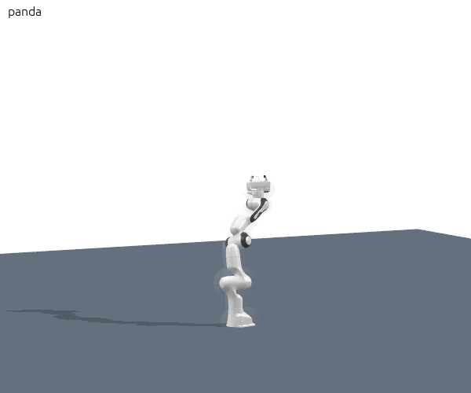

# Note

old env: tensorflow               2.2.0


# python3.8

```c++
//time.clock() 

time.perf_counter()
```

```smp_manifold_learning/motion_planner/util.py``` line 130, add , to avoid nan and inf value
```c++
data = np.nan_to_num(data, nan=0.0, posinf=1e10, neginf=-1e10)

```
---

## panda test
---
### quat constraint
```c++

self.start = np.array([1.52175 ,-0.233728, 2.06986, -0.871483, -2.8973, 2.14285, 1.76038])
self.manifolds.append(PointFeature(goal=np.array([2.30847, -1.7628, 0.158844 ,-1.41184 ,-0.425815, 2.75658, 0.477064 ])))

```

|panda quaternion constraint with hard coding| |
|---|
| | 